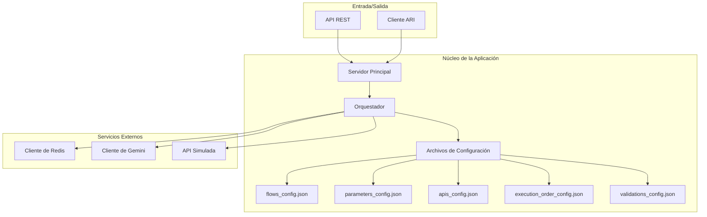

# Arquitectura del Sistema

Este documento describe la arquitectura del Orquestador de Conversaciones Inteligente.

## Componentes Principales

El sistema se compone de los siguientes módulos principales:

-   **Servidor (API/ARI)**: El punto de entrada para las interacciones.
-   **Orquestador**: El cerebro del sistema. Gestiona el flujo de la conversación, el estado y la lógica de recolección de parámetros.
-   **Cliente de Redis**: Se encarga de la persistencia del estado de la conversación.
-   **Cliente de Gemini**: Interactúa con la API de Google Gemini.
-   **Archivos de Configuración**: Definen el comportamiento del orquestador.
-   **API Simulada**: Un servidor para pruebas.

## Diagrama de Flujo de Datos

## Diagrama de Componentes

